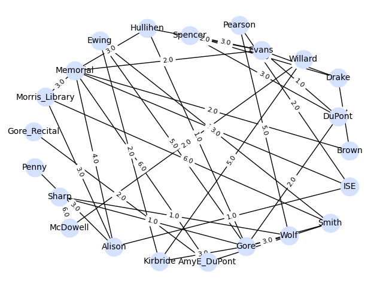

# Title of Your Project

**CISC320 Spring 2023 Lesson 14 - Graph Applications**

Group Members:

- Michael Bocelli (mbocelli@udel.edu)
- Joshua Martinez (zenitram@udel.edu)
- Evan Lewis (lewisev@udel.edu)
- Victor Tung (vtung@udel.edu)

Description of project

## Installation Code

```sh
$> pip install networkx
```

## Python Environment Setup

```python
import networkx as nx
```

# Order of Bus Charging Station Installation

**Informal Description**:
As the head of transportation for the University of Delaware, you have been
tasked with installing several charging stations for UD's new electric bus
program, which will provide a clean and efficient transportation system for
students. However, certain charging stations require that others
be installed before them, so that they may be daisy-chained on the same
power line. Determine a correct order of installation by performing a
topological sort (through implementing a DFS) on the given, directed, acyclic graph
of installation tasks, where each edge represents a dependency between two nodes,
which represent the charging stations that need to be installed.

> **Formal Description**:
>
> - Input: A directed, acyclic graph G(E,V), where E is the set of edges, and V is the set of vertices.
> - Output: A list of the vertices in V sorted in topological order.

**Graph Problem/Algorithm**: DFS

**Setup code**:

```python
import networkx as nx

dfs_graph = nx.read_adjlist("dfs_adjacency_list.txt", create_using=nx.DiGraph)
```

**Visualization**:


**Solution code:**

```python
topologically_sorted_nodes = [*nx.topological_sort(dfs_graph)]
print(topologically_sorted_nodes)
```

**Output**

```
['Charger_I', 'Charger_K', 'Charger_X', 'Charger_O', 'Charger_A', 'Charger_G', 'Charger_L', 'Charger_B', 'Charger_M', 'Charger_V', 'Charger_Y', 'Charger_F', 'Charger_P', 'Charger_Q', 'Charger_E', 'Charger_H', 'Charger_J', 'Charger_Z', 'Charger_U', 'Charger_T', 'Charger_R', 'Charger_D', 'Charger_W', 'Charger_N', 'Charger_S', 'Charger_C']
```

**Interpretation of Results**:
The results demonstrate the order in which the charging stations must be installed before installing others. For instance,
to install Charger_C, all other chargers must be installed first in their respective order in the list. Since Charger_G comes
after Charger_A, then Charger_A must be installed first, and so on.

# Least amount of Track to build to deliever supplies to select buildings

**Informal Description**:
As the head of transportation for the University of Delaware, you have been tasked with implementing a
track system to transport pertainant supplies between select academic buildings. Due to the high cost
of building the system and your tight budget you must lay the smallest amount of track needed to reach
every building that needs supplies tracks can only be laid among certain predefined paths gievn to you
by your boss. Unfortunately your boss was lazy

> **Formal Description**:
>
> - Input: A undirected graph G(E,V), where E is the set of edges, and V is the set of vertices.
> - Output: A list of the edges in E given as (V1, V2) that when put together create a minimum spanning tree.

**Graph Problem/Algorithm**: Prim's

**Setup code**:

```python
import networkx as nx
import matplotlib.pyplot as plt

G = nx.read_weighted_edgelist("./PrimsGraphEdgeList.txt")
```

**Visualization**:



**Solution code:**

```python
mst = nx.minimum_spanning_edges(G, algorithm="prim", data=False)
edgelist = list(mst)
print(edgelist)
```

**Output**

```
[('ISE', 'Alison'), ('ISE', 'Pearson'), ('ISE', 'Memorial'), ('Memorial', 'Evans'), ('Evans', 'DuPont'), ('Evans', 'Drake'), ('Drake', 'Brown'), ('Evans', 'Hullihen'), ('Hullihen', 'Gore'), ('Gore', 'Sharp'), ('Sharp', 'Wolf'), ('Drake', 'Spencer'), ('Gore', 'Smith'), ('Alison', 'Morris_Library'), ('Alison', 'Penny'), ('Gore', 'Kirbride'), ('Kirbride', 'Ewing'), ('Smith', 'AmyE_DuPont'), ('AmyE_DuPont', 'Gore_Recital'), ('Kirbride', 'Willard'), ('Willard', 'McDowell')]
```

**Interpretation of Results**:
The results demonstrate the buildings in which the tracks must be built between in order to have the least amount of track. For example, given the first element of the list ('ISE', 'Alison') We would build a
track between those two buildings. After building all the tracks given by the output we would have created a graph between all buildings with the lowest length of track and no cycles aka the MST.

# Connection between Academic Buildings

**Informal Description:** As the head of transportation for the University of Delaware, you are tasked with creating efficient directions between buildings. You must take 2 of the furthest academic buildings and connect a path of subsequent buildings so that students can minimize the distance to class. A predetermined and efficient route has been given to you and you must consider other buildings and their nearby paths.

> **Formal Description**:
>
> - Input: A undirected graph G(E,V), where E is the set of edges, and V is the set of vertices.
> - Output: A list of the vertices in V that has the shortest path from start to destination.

**Graph Problem/Algorithm**: Dijkstra's

**Setup code**:

```python
import networkx as nx
import matplotlib.pyplot as plt

G = nx.Graph()  # new graph

# academic buildings
G.add_node('Alison')
G.add_node('Brown')
G.add_node('Colburn')
G.add_node('Ewing')
G.add_node('Gore')
G.add_node('ISE')
G.add_node('Hartshorn')
G.add_node('Kirkbride')
G.add_node('McDowell')
G.add_node('Memorial')
G.add_node('Mitchell')
G.add_node('Old College')
G.add_node('Penny')
G.add_node('Pearson')
G.add_node('Purnell')
G.add_node('Sharp')
G.add_node('Smith')
G.add_node('Spencer')
G.add_node('Willard')

G.add_node('The Green')

# add edges (weight is distance in Meters)

# Connected to The Green
G.add_edge("Alison", "The Green", weight=39)
G.add_edge("Memorial", "The Green", weight=10)
G.add_edge("Brown", "The Green", weight=14)
G.add_edge("Mitchell", "The Green", weight=38)
G.add_edge("Gore", "The Green", weight=7)
G.add_edge("Sharp", "The Green", weight=11)
G.add_edge("Alison", "The Green", weight=31)
G.add_edge("Old College", "The Green", weight=132)
G.add_edge("Hartshorn", "The Green", weight=107)

G.add_edge("Brown", "Memorial", weight=51)
G.add_edge("Alison", "Memorial", weight=68)
G.add_edge("Alison", "ISE", weight=85)

G.add_edge("Old College", "Willard", weight=90)
G.add_edge("Old College", "McDowell", weight=37)
G.add_edge("Willard", "McDowell", weight=20)

G.add_edge("Willard", "Ewing", weight=186)
G.add_edge("Gore", "Smith", weight=44)
G.add_edge("Purnell", "Smith", weight=20)
G.add_edge("Ewing", "Smith", weight=56)
G.add_edge("Kirkbride", "Smith", weight=28)
G.add_edge("Kirkbride", "Purnell", weight=61)
G.add_edge("Kirkbride", "Ewing", weight=33)
G.add_edge("Ewing", "Purnell", weight=24)

G.add_edge("Colburn", "Spencer", weight=5)
G.add_edge("Colburn", "Pearson", weight=61)
G.add_edge("Spencer", "Pearson", weight=76)
G.add_edge("Colburn", "ISE", weight=58)
G.add_edge("ISE", "Brown", weight=176)
G.add_edge("ISE", "Penny", weight=61)
G.add_edge("Alison", "Penny", weight=97)
```

**Visualization**:


**Solution code:**

```python
solve_dijkstra(G, 'Hartshorn', 'Ewing')

def solve_dijkstra(G: nx.DiGraph, source, target):
    try:
        path = nx.dijkstra_path(G, source, target)
    except nx.exception.NetworkXNoPath:
        return print(f'No path from {source} to {target}')
    else:
        print(path)
```

**Output**

```
['Hartshorn', 'The Green', 'Gore', 'Smith', 'Purnell', 'Ewing']
```

**Interpretation of Results**:
The results show that the connection starting at Hartshorn Hall must take a path through various buildings to get to Ewing Hall. To show students a good way to get to class, we would then have them follow along The Green to connect to Gore and passing by the other buildings until they arrive at Ewing Hall. This result contains the shortest path that works as a guide for students of the University of Delaware.

# Visiting all dorms on south campus

**Informal Description**:
As a new student at the University of Delaware, you are completely clueless as to where the dorms are. All you know is the name of your dorm, a picture of your friend's dorm, and that you are on south campus. Unfortunately, your phone died right as your friend invited you to a party. Luckily, you have a map of all the dorms on south campus. Therefore, you have decided to visit each dorm to find your friend. Since you have a terrible memory and sense of direction, however, you make sure to only visit all the dorms and areas immediately accessible before moving on to the next.

> **Formal Description**:
>
> - Input: An undirected graph G(E,V), where E is the set of edges, and V is the set of vertices.
> - Output: A list of sets of vertices V, which represent the nodes at each level of the bfs tree from a given root node.

**Graph Problem/Algorithm**: BFS

**Setup code**:

```python
import networkx as nx
import matplotlib.pyplot as plt

G = nx.read_adjlist("bfs_adjlist.txt")
```

**Visualization**:


**Solution code:**

```python
result = [*nx.bfs_layers(G, "Russell_Hall_A")]
print(result)
```

**Output**

```
[['Russell_Hall_A'], ['Harrington_Turf', 'Russell_Hall_B', 'Russell_Hall_C', 'Russell_Hall_D', 'Russell_Hall_E'], ['Harrington_Lounge', 'Redding_Hall', 'Gilbert_Hall', 'Path_To_Turf'], ['Harrington_Hall_A', 'Harrington_Hall_B', 'Harrington_Hall_C', 'Harrington_Hall_D', 'Harrington_Hall_E', 'Lane_Hall', 'Thompson_Hall', 'Academy_Street'], ['Caesar_Rodney_Hall', 'Smyth_Hall', 'The_Green'], ['Cannon_Hall', 'New_Castle_Hall', 'Kent_Hall', 'Sussex_Hall', 'Squire_Hall']]
```

**Interpretation of Results**:
The results show the dorms and areas that are immediately accessible from your current location. The first list represents the starting node, which is Russell_Hall_A in this case. The second list represents shows all the dorms and areas immediately accessible from Russell_Hall_A, which will be traveled to next. Then, the third list represents all the dorms and areas accessible from the second list. The same thing applies for the rest of the lists. This effectively gives us the levels of the tree with the dorms and areas as nodes, paths as edges, and Russell_Hall_A as the root node.